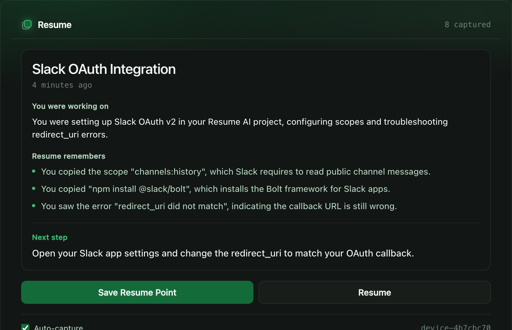
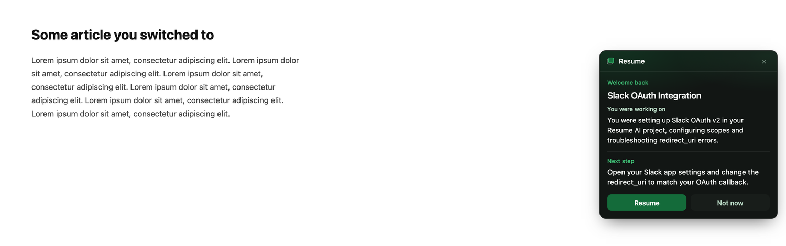

# Resume

An AI memory layer for your work. Resume watches what you're doing across
tabs, and when you come back it hands you your train of thought — what you
were doing, what mattered, and what to do next.

> Your apps remember what you did. Resume remembers *why*.

## What it looks like

Browse, copy, get distracted. Resume reconstructs the work — not the
browsing — and tells you what to do next.



Switch tabs a couple of times and it offers your work back, in place, on
whatever page you landed on.



Note what it did *not* say: the activity behind that card included YouTube
tabs. Resume treated them as noise and named the real thread.

## Try it (reviewers start here)

The extension is a **27 KB download** — no build step, no npm.

1. Download **[`docs/resume-extension.zip`](docs/resume-extension.zip)** and unzip it
2. Open `chrome://extensions`
3. Turn on **Developer mode** (top right)
4. **Load unpacked** → select the unzipped `resume-extension` folder
5. Click the Resume icon to open the side panel

Then browse a few pages, copy something, and hit **Save Resume Point**.

> A Chrome extension cannot be hosted on a URL — Chrome only installs from a
> local folder or the Web Store (which takes days to review). Load unpacked
> is the standard way to run an unpublished extension.

**The backend** it talks to is set in `config.js` → `API_BASE`. Out of the
box that's `http://localhost:3000`, which requires the Setup section below.
If you were given a hosted URL, put it there instead and skip setup entirely.

## How it fits together

```
Chrome extension  ──POST /api/summarize──▶  Next.js  ──▶  Groq (LLM)
  captures tabs,                                      ──▶  Supabase
  copies, idle                                             │
                  ◀──GET /api/resume-points───────────────── ┘
```

- **`extension/`** — the capture layer (MV3, vanilla JS). Side panel + the
  return bubble. No secrets live here.
- **`app/api/`** — summarize and read Resume Points. All keys stay here.
- **`supabase/`** — the schema migration.

## Setup

You need **Node 18+**, **Chrome**, and the three values in
[`.env.example`](.env.example).

```bash
git clone https://github.com/aaravdrana-hue/resume-ai.git
cd resume-ai
npm install
cp .env.example .env.local
```

Now open `.env.local` and fill in all three values:

| Variable | Where it comes from | Shared across the team? |
|---|---|---|
| `GROQ_API_KEY` | [console.groq.com/keys](https://console.groq.com/keys) | No — get your own, it's free |
| `SUPABASE_URL` | Supabase → Settings → API | **Yes** — same project for everyone |
| `SUPABASE_SERVICE_ROLE_KEY` | Supabase → Settings → API | **Yes** — same project for everyone |

Two traps that cost real time:

- The Groq key **must start with `gsk_`**. An OpenAI `sk-` key returns
  `401 Invalid API Key`.
- Use the Supabase **secret** key (`sb_secret_…`) or legacy `service_role`
  (`eyJ…`). The publishable/anon key can't write past RLS.

Then start the backend — it must be running for the extension to work:

```bash
npm run dev
```

### Database

Only needs doing **once per Supabase project** (already done for ours). If
you're starting fresh, paste [`supabase/schema.sql`](supabase/schema.sql)
into the Supabase SQL Editor and run it.

### Load the extension

1. Open `chrome://extensions`
2. Turn on **Developer mode** (top right)
3. **Load unpacked** → select the `extension/` folder

Click the Resume icon to open the side panel. Browse a few pages, copy
something, then hit **Save Resume Point**.

After you switch tabs twice, a bubble appears at the right edge of the page
offering to hand your work back.

## Using a deployed backend instead

If the backend is hosted, nobody needs Node, keys, or a local server — they
just load the extension. Point it at the deployment in two places:

1. `extension/config.js` → `API_BASE`
2. `extension/manifest.json` → `host_permissions`

## Notes

- `.env.local` is gitignored. Never commit real keys; share them through a
  password manager, not chat or screenshots.
- Restart `npm run dev` after editing `.env.local` — Next.js only reads env
  at startup.
- The extension holds no secrets. It only ever calls this app's API.
